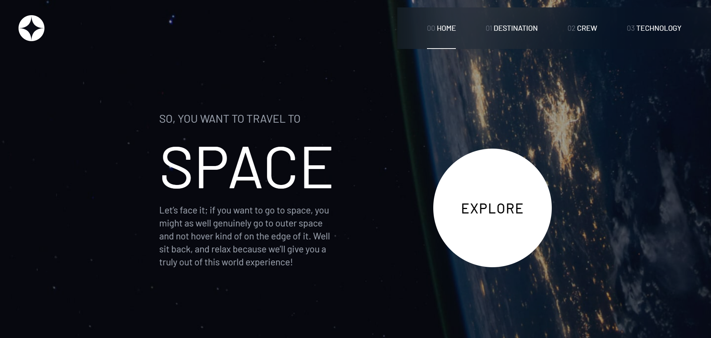

# ​ Site Turismo Espacial

Uma página web temática sobre turismo espacial, criada como projeto front‑end para demonstrar habilidades em desenvolvimento de interfaces modernas, responsivas e interativas.

---

## ​ Sobre o projeto

Este projeto tem como objetivo apresentar uma experiência visual sobre destinos espaciais, tripulação e tecnologia relacionada. Inspirado por designs do **Frontend Mentor**, o site mostra minha capacidade de transformar layouts em páginas funcionais usando HTML, CSS e JavaScript.

---

## ​ Tecnologias utilizadas

- HTML5
- JavaScript (ES6+)
- [Angular / TailwindCss]

---

## ​ Funcionalidades

- Layout responsivo que se adapta a telas desktop, tablet e mobile  
- Navegação entre seções (destinos, tripulação, tecnologia)  
- Uso de Tailwind para efeitos interativos e transições suaves  
- Possível consumo de JSON local ou API para dados dinâmicos

---

## ​ Demonstração

  

---

## ​ Como rodar o projeto localmente

```bash
# Clone este repositório
git clone https://github.com/william3002/site-turismo-espacial.git

# Acesse a pasta do projeto
cd site-turismo-espacial

# Abra o arquivo index.html no navegador
# Ou, se teve build process:
npm install
npm start
